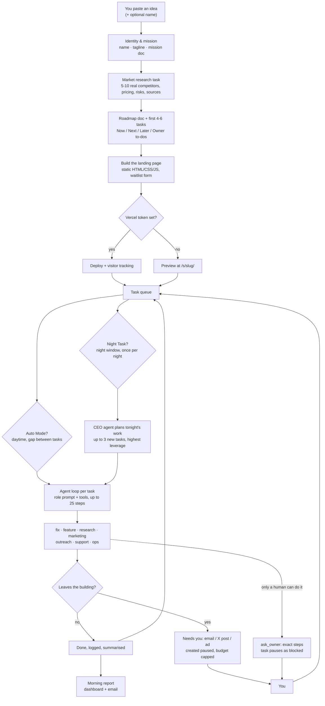

# Nightshift — the idea

> Describe an idea. A team of AI agents writes the mission, researches the market,
> plans the roadmap, builds and deploys the website, then keeps working the queue
> overnight. You get a morning report. You approve anything that leaves the building.

---

## 1. The idea, in one paragraph

Nightshift is a **self-hosted AI co-founder**: one app you run on your own machine or
VPS, holding a whole company inside it. You paste an idea (a textarea, 2,000 characters),
and a team of agents turns it into a real business: identity and mission, market
research with live sources, a roadmap, the first handful of tasks, a landing page,
a deploy, and a drafted launch post. From then on it works the task queue on its own:
by day in **Auto Mode**, and during your night window as **Night Task**, when a CEO
agent plans the next work and the team does it. A report is waiting for you in the
morning. Nothing outward-facing (email to a stranger, an X post, ad spend) leaves
without your approval. The AI backend is your own OpenAI-compatible API key
(DeepSeek by default), so the "payroll" for the team is a metered API bill with a
hard daily cap.

The shape to hold in your head: **not a chatbot that helps you build, and not a
coding agent that waits for instructions. A company that runs whether or not you
are at the keyboard today.**

---

## 2. The problem

Building a one-person business is a serial bottleneck problem:

- The website, the research, the outreach, the support replies, the pricing page,
  the ad copy, the follow-ups — each is small, each is doable, none of them happen
  while you are at your day job.
- Chat assistants give you answers, not progress. Every session starts from zero,
  you are the memory and the hands.
- Coding agents are excellent at a scoped task in a repo, but "run a company" is
  not a diff. It is a queue of mixed work: research, copy, email, ads, admin, and
  a dozen accounts only a human can open.
- Hiring or freelancing fixes it with money and management overhead. A pre-revenue
  idea can afford neither.

Nightshift's bet: most of that work is now within reach of a cheap text model plus
tools, and what was missing was not intelligence but **plumbing and supervision**.
A place for the work to queue up, a loop that keeps picking it up, a paper trail of
what each agent did and why, an approval gate at the door, and a cost meter that
stops the whole thing before it surprises you.

---

## 3. The insights the product is built on

1. **Agents should be workers with a queue, not conversations.** Everything the AI
   team does becomes a task row with a type, a status, a step count, a cost, and a
   log you can open. Work survives restarts, gets retried, and can be reordered by
   drag-and-drop. Chat is for strategy ("talk to your co-founder"), not for getting
   things done.

2. **The owner is the bottleneck, so make the bottleneck explicit.** Anything only a
   human can do (create an account, verify a domain, paste a key, make a legal or
   brand call) is never faked and never a task: the agent calls `ask_owner`, which
   files a request with exact steps and pauses the task as **blocked** instead of
   failing it. The dashboard says "waiting on you", and the morning report lists it.
   A blocked task is a hand-off, not an error.

3. **Autonomy you cannot audit is not autonomy.** Every task keeps its full step
   log: each tool call with arguments, each tool result, reasoning traces when the
   model emits them, and a written summary of what was done and what remains. The
   claim "the agent said it did it" is never enough: the code forces agents to act
   through tools rather than describe acting.

4. **A supervision cockpit beats an autonomy dial.** Approvals default to on for all
   three outward channels. Emails to you skip the gate; a launch post is always a
   draft even with approvals off; ad campaigns are always created **paused** and are
   clamped to a maximum daily budget. The product's promise is "you review work in
   ten minutes a morning", not "you never look".

5. **Machine-written text is a product defect.** Every agent carries a writing guide
   in its system prompt, and a cheap regex detector catches the strongest AI tells
   (em dashes, "delve", "not just X but Y", emoji bullet walls, exclamation piles).
   When it fires, outward-facing writes bounce back once for a rewrite, and reports
   and summaries get one rewrite pass. Text you wrote or supplied is never touched.
   This is a real feature because the fragile part of an AI-run company is how it
   sounds to customers.

---

## 4. Who it's for

- **A solo founder with a day job.** Wants the boring half of a launch done by
  morning, and reviews rather than operates.
- **Someone with an audience or a domain, not a codebase.** The product surface is a
  static site plus email, posts and ads, so the ceiling is early-stage validation:
  landing page, waitlist, first paying customers via payment links.
- **A technical owner with a data or content pipeline already running.** Nightshift
  sells the wrapper business (site, waitlist, outreach, support), not the product.
  The SafaStack run is exactly this: the owner's existing pipeline makes the data,
  Nightshift makes the company around it.
- **A tinkerer who wants to own the stack.** Self-hosted, one SQLite file, no vendor
  account, bring your own model key.

Explicitly not for: teams needing role-based access (there is one owner), anyone
expecting a general-purpose app builder (agents ship static sites only), or anyone
who wants to spend nothing (a real run costs cents, but cents of your key).

---

## 5. The loop

Cadence details that matter: the scheduler ticks every 30 seconds and runs **one
task at a time** across all companies, round-robin by whichever company worked least
recently, with a settable gap (default 5 minutes) between Auto Mode tasks. Night
window defaults to 01:00 to 06:00 local, the morning report lands at 07:00, and the
CEO agent only plans when fewer than four tasks are open, so the queue cannot run
away from you.

---

## 6. The team

Seven task types, each with its own role prompt, toolset and rules. Tools are gated
by task type, and integrations that are not set up are simply not offered, with the
missing piece named for the owner.

| Agent | Does | Notable tools |
| --- | --- | --- |
| **engineering** (`fix`, `feature`) | Edits the company website: smallest correct change, shippable increments, snapshot per change | `list_files`, `read_file`, `write_file`, `delete_file`, `deploy_site` |
| **research** | Investigates with real sources, cites URLs, flags uncertainty, saves findings as documents | `web_search`, `fetch_url`, `write_document`, `read_document` |
| **marketing** | Landing-page copy, X posts (280 chars, one hashtag max), Meta campaigns, only once the site is publicly live | `post_to_x`, `create_meta_ad`, file tools |
| **outreach** | Up to 5 well-matched prospects per task, personal emails under 120 words, published contact addresses only, one-line opt-out | `send_email`, `read_inbox`, `web_search` |
| **support** | Reads the inbox, answers honestly, never promises dates or features, escalates refunds/legal to you | `read_inbox`, `reply_email` |
| **ops** | Pricing, payment links, documents, business admin | `create_payment_link`, `write_document` |
| **CEO** (planning) | Plans the night's work and writes the morning report, from the company brief and real metrics only | One JSON planning call, plus the metrics block injected into its prompt |

Shared tools: `create_task` (max 2 follow-ups per task), `list_tasks`, `ask_owner`,
`get_metrics`. Engineering rules are blunt on purpose: relative asset paths, one
stylesheet, no invented testimonials or metrics, waitlist forms use the platform's
own `<form data-waitlist>` instead of hand-written JS, and API keys never appear in
site files.

---

## 7. The controls (what makes it safe to leave running)

- **Approvals**: email to non-owner addresses, X posts and ad spend wait under
  "Needs you". All three default on.
- **Budget**: a daily AI cap (default $2) measured from a real `usage` table with
  editable token prices. When it is reached, planning and work stop for the day and
  the UI says so. Tasks interrupted by budget or a bad key are requeued, not failed.
- **Ad cap**: agents can never set a daily budget above `ads_max_daily_budget`
  (default 10), and campaigns are created paused regardless.
- **Health surfacing**: one module knows whether each integration (AI, search, email,
  inbox, Vercel, visitor tracking, Stripe, X, Meta) is ready, off, or broken, and
  exactly why. Failures are recorded where they happen and cleared by the next
  success, so a dead integration shows as a banner with the provider's own message.
  Agents are told which integrations are unusable and must say which one blocked them.
- **Local by default**: the dashboard only answers to `localhost` or hostnames you
  allow-list, unless you set a password; API writes must be same-origin JSON (CSRF
  and DNS-rebinding guards); secrets live in a 0600 SQLite file and the browser only
  ever learns whether a key is set. Generated sites are served under a sandbox CSP,
  so the scripts in them cannot reach the dashboard API.
- **Stop button**: pause the scheduler, pause Auto Mode or Night Task per company, or
  cancel a single running task.
- **Publishing is scoped to the site's reachable surface.** A deploy uploads the pages plus
  only what those pages actually link (assets, data files, the docs they point at), so the
  agent's tooling, internal notes and fixture/sample data stay in the working copy. Every
  exclusion is listed with its reason next to the Deploy button, and a file that would go
  live while holding something credential-shaped blocks the deploy instead of shipping.

---

## 8. How it differs

| | Nightshift | Chat assistant | Coding agent | Hiring a freelancer |
| --- | --- | --- | --- | --- |
| Unit of work | A task in a queue, with a log and a cost | A reply | A diff in a repo | A contract |
| Who keeps it moving | The loop, on a schedule | You, every session | You, every prompt | A person, with reminders |
| Memory | Company docs: mission, research, roadmap | The context window | The repository | Their head |
| Overnight | That is the whole point | Nothing happens | Nothing happens | Invoices |
| Cost model | Your key, metered, hard daily cap | Subscription | Subscription | Money and management |
| Outward action | Blocked behind approval by default | N/A | N/A | Trust, after the fact |

The honest differentiator is not model quality. It is that the work has a home, a
schedule, an audit trail, and a gate.

---

## 9. What is proven today

Real numbers from the first live run (SafaStack, a Shariah-screened stock data
product, created 2026-09-11 and left running while this doc was written):

- Bootstrap completed end to end: mission, market research document, roadmap, first
  tasks, landing page with waitlist, launch post drafted for approval, welcome email.
- 7 tasks finished, 13 open in the queue across five types; 4 documents saved.
- 114 model calls, **$0.63** of AI spend for a whole company setup. That is the
  pitch in one number: a company bootstrapped for the price of a coffee.
- Two emails sent (the welcome, then one to the owner), zero revenue, zero waitlist
  signups, zero ad spend. Auto Mode is off by default; Night Task is on by default,
  and the live company had it switched off while the owner was still setting up
  accounts.

Stack shape: Node 22.13+ with built-in `node:sqlite`, a Hono HTTP layer with SSE for
live updates, a React 19 + Vite dashboard, one process on port 4455 and a second
public-only port 4456 for the tracker, waitlist and hosted sites (the piece a tunnel
points at). Everything lives in `data/`, including the database and every version of
every site.

---

## 10. Honest limits

- **The product is always a static website.** No backend, no database, no login for
  the end customer. That caps Nightshift at waitlist-and-landing-page businesses
  unless the owner brings their own product (as SafaStack does).
- **Text only.** No image or video generation, so brand assets and social visuals are
  copy, not craft.
- **Overnight work is unattended.** If the process is not running on an always-on
  machine and the report is not delivered, silence looks like success. Health
  surfacing and the morning report are the mitigation, not a cure.
- **Approvals make "autonomous" mostly mean "queued".** The value is the quality of
  the queue and the morning review, not hands-off operation.
- **Single owner, no team login.** One owner email, no roles, no shared workspace.
  Per-company account overrides exist (X, Meta, Stripe, sender) but there is one
  human identity.
- **Dependency on other people's approvals.** X and Meta integrations follow the
  official APIs and depend on the owner's developer accounts being granted access.
- **Quality of the queue is the real product risk.** A CEO agent that plans mediocre
  tasks produces busywork overnight at your expense. The reward is that this is
  cheap to observe and correct.

---

## 11. Where it goes next (open questions, not promises)

1. **Real product surface.** Per-company backend or data API so agents can build
   things past a landing page. This is the single biggest ceiling on the idea.
2. **Team and roles.** Auth beyond "localhost or a password" so a co-founder can log
   in without sharing the owner's machine.
3. **Visual generation.** A vision-capable model for site imagery and ad creative.
4. **Cadence as a first-class feature.** Recurring work (weekly outreach, monthly
   pricing review) rather than a queue the CEO tops up nightly.
5. **Honest performance reporting.** Revenue, waitlist and visitor deltas tied to the
   tasks that plausibly caused them, with no invented attribution.

---

## 12. What Nightshift is deliberately not

- Not an app builder, not a no-code platform, not a DevOps tool.
- Not a marketplace of prebuilt agents, and not a hosted SaaS where the vendor holds
  your keys: you self-host, you bring the model key, you own the data file.
- Not a way to avoid work. It is a way to make the work show up finished.
