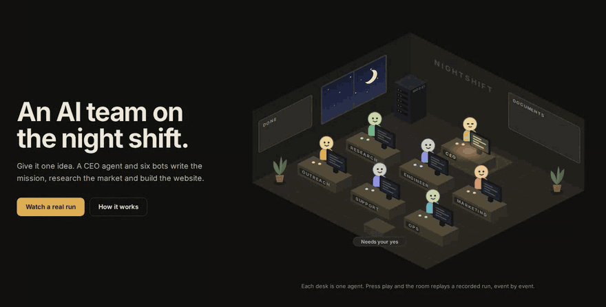
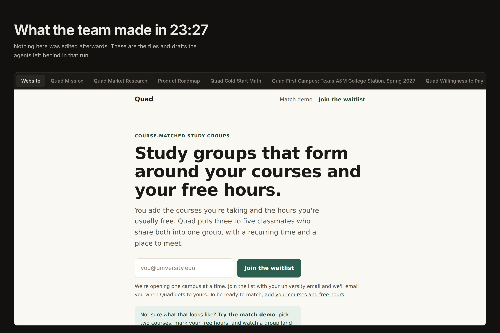
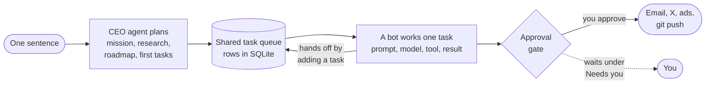
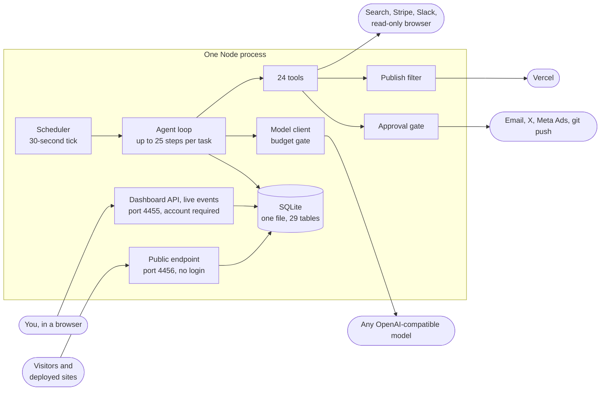

<div align="center">

# ☾ Nightshift

### One sentence in. A working company by morning.

A self-hosted team of AI agents that takes an idea, writes the mission, researches the market,<br/>
plans the roadmap, builds the website, and keeps working the queue while you sleep.<br/>
You wake up to a report, and nothing leaves the building without your yes.

<p>
  
  
  
  
  
  
  
</p>

### [▶ Watch the live replay](https://track.safastack.com/)

[One real run](#one-real-run) ·
[How it works](#how-it-works) ·
[Engineering decisions](#engineering-decisions) ·
[Architecture](#architecture) ·
[Quick start](#quick-start)

<br/>

<a href="https://track.safastack.com/"></a>

<sub>A replay of a real run, recorded on 4 October 2026. Each desk is one agent. 23 minutes of work, played back in under 30 seconds.</sub>

</div>

<br/>

<table align="center">
  <tr>
    <td align="center" width="190"><h3>23:27</h3><sub>from idea to a built site,<br/>8 documents and 6 drafts</sub></td>
    <td align="center" width="190"><h3>245</h3><sub>tool calls across<br/>19 planned tasks</sub></td>
    <td align="center" width="190"><h3>$0.48</h3><sub>total model spend<br/>for the whole run</sub></td>
    <td align="center" width="190"><h3>0</h3><sub>messages sent without<br/>the owner's approval</sub></td>
  </tr>
</table>

## What it is

Most AI tools wait for you. A chatbot answers when you ask. A coding agent works while you watch.
Nightshift is built the other way round: it is a company that keeps running whether or not you are
at the keyboard today.

You type one idea. A CEO agent plans, and six named bots (Engineer, Research, Marketing, Outreach,
Support and Ops) pick the work up from a shared queue. By day they work in **Auto Mode**. During
your night window, **Night Task** has the CEO plan the next round and the team works through it.
In the morning a report is waiting, written from the database rather than by a model.

You stay the owner. Emails to strangers, posts, ad spend and git pushes are saved as drafts and
wait under **Needs you** until you approve them. The AI backend is your own API key (DeepSeek by
default, any OpenAI-compatible provider works), so the team's payroll is a metered bill with a
hard daily cap.

## One real run

The numbers above come from a single recorded run. The input was one sentence:

> A study-group matcher for university students: you enter your courses and free hours, and it
> puts you in a small group of classmates studying the same thing at the same time.

Twenty-three minutes later the team had named it **Quad** and left this behind, unedited:



| What | Made by | Detail |
| --- | --- | --- |
| A landing page with a waitlist form and a clickable match demo | Engineer | Static HTML, CSS and JS, built from the mission and the research |
| Mission, market research and a product roadmap | CEO, Research | The research cites live web sources |
| Cold-start math, a first-campus pick and a pricing interview script | Research | Follow-up tasks the team queued for itself |
| A two-week plan for a manual matching pilot | Ops | One operator, 30 signups, one campus: the whole procedure on a page |
| A launch post, five outreach emails and an outreach log | CEO, Outreach | All six drafts stopped at "waiting for approval" |
| Five questions for the owner | Research, Engineer, Marketing | Things only a human can decide, such as approving the first campus |

The whole run used 116 model calls and 5.06 million tokens on `deepseek-flash`.
**[Watch it play back, and read everything the team wrote](https://track.safastack.com/).** The
[landing page](#the-public-landing-page) replays the run event by event from a JSON file, so a
visitor can watch it without touching the API, the model or anyone's keys.

## How it works



1. **One sentence.** You type an idea. That is the only input a run needs.
2. **The CEO agent plans.** One model call writes the name and mission. Another reads the research and writes a roadmap and the first tasks.
3. **A shared queue.** Each task is a row in SQLite with a type and a priority. The type decides which bot picks it up.
4. **A bot works it.** Its role, skills and notebook become the prompt. Then it loops: the model asks for a tool, the server runs it, the result goes back. Up to 25 steps per task.
5. **A human says yes.** Emails, posts, ads and commits are saved as drafts. Nothing reaches the outside world until the owner approves it.

### The team

| Bot | What it does |
| --- | --- |
| **CEO** | Plans the roadmap and the next round of tasks. Runs the setup and the nightly planning. |
| **Engineer** | Fixes bugs and ships features on the company website. |
| **Research** | Watches the market and rivals, and cites its sources. |
| **Marketing** | Posts for X, runs capped ad campaigns, and sharpens landing copy. |
| **Outreach** | Finds well-matched prospects and drafts short first emails. |
| **Support** | Answers the inbox and hands real bugs to Engineer. |
| **Ops** | Pricing, payment links, documents and admin. |

Each bot has **skills** (how it does the job, shared by every company that hires it), a
**notebook** per company (facts it learned there, kept only after you review them, never shown to
another company) and optional **routines** that add tasks on a schedule. The **Bot library** holds
the templates: hire one into a company, save a bot as your own template, or export and import one
as a file. A template never carries memory.

## Engineering decisions

I designed and wrote Nightshift end to end: the agent loop, the queue, the approval gates and the
dashboard. These are the decisions I would defend in a review.

**Guardrails live in code, not in prompts.** A page can contain text aimed at the bot, and a
prompt can be talked out of a rule. So every limit that matters is enforced by the server:

| Rule | Where it is enforced |
| --- | --- |
| Nothing outward-facing leaves without approval | Every email, post, ad and push goes through one module, [`server/actions.ts`](server/actions.ts), which holds the gate and the audit trail |
| The bot's browser is read-only | [`server/browser.ts`](server/browser.ts) aborts every request that is not GET or HEAD, offers no click or type, starts each call with a clean context, and refuses localhost, the tailnet and private addresses |
| Agents can commit but cannot damage a repo | [`server/git.ts`](server/git.ts) passes fixed argument arrays to `git` with no shell. No force-push, no history rewrite, no remote changes, and never the main branch |
| A deploy cannot leak a key or a draft | [`server/publish.ts`](server/publish.ts) publishes only what a page can reach, and stops the deploy if a file that would go live contains something shaped like a credential |
| Spend has a ceiling | Every model call passes one budget gate in [`server/llm.ts`](server/llm.ts). At the cap a task pauses and keeps its conversation, so resuming does not pay twice |
| Agent-written pages cannot reach the dashboard | They are served under a `sandbox` Content-Security-Policy, and agent markdown is sanitized before it renders |

**Every step leaves a trail.** Each tool call and its result is saved as a row, so any task can be
opened and read back: what the bot searched for, what it read, what it wrote and why.

**A handoff is a task.** No agent calls another directly. To pass work on, a bot adds a task to
the queue and the task's type decides who picks it up. Nothing runs that the queue does not show,
and the budget, Auto Mode and Night Task keep the same say over every piece of work.

**Skills travel, memory stays.** A bot's skills belong to its template and follow it to every
company. Its notebook belongs to one bot at one company, every read filters on both, and a note
only reaches a prompt after the owner has kept it.

**No framework between me and the model.** There is no agent library and no ORM. The loop is 167
lines in [`server/agents/runner.ts`](server/agents/runner.ts), the model client is a hand-written
OpenAI-compatible client, and the database is `node:sqlite` from the standard library. The whole
app is about 15,000 lines of strict TypeScript with 15 runtime dependencies, one Node process and
one SQLite file.

**It checks its own writing.** A detector with no AI call catches the strongest tells of
machine-written text: dashes used as commas, stock words, staged contrasts. Outward-facing writing
that trips it bounces back to the agent for one rewrite before it is saved or sent. This README
passes the same checker.

**Tested where it matters.** 98 tests on Node's built-in runner cover the pieces that would hurt
most if they broke: the read-only browser, memory isolation between companies, resumable
conversations, the owner's decision list, accounts, deploy states and the Slack and GitHub
integrations. Run them with `npm test`.

## Architecture



Two doors, on purpose. Port 4455 holds everything and needs an account. Port 4456 serves only
what a stranger may see, and it is the only one you ever expose to the internet.

| Layer | Built with |
| --- | --- |
| **Server** | Node 22 and Hono in one process. SQLite through `node:sqlite`, so the whole state is one file. |
| **Agents** | Any OpenAI-compatible model. 24 tools, a 25-step ceiling per task, and a read-only headless browser (Playwright). |
| **Web** | React 19, Vite and Motion. Live updates arrive over server-sent events. |
| **Integrations** | Web search, email (SMTP, Resend, IMAP), Vercel, Stripe, Slack, GitHub Actions, X and Meta Ads. |

```
server/
  index.ts          HTTP API, SSE, hosted sites, public endpoint
  db.ts             SQLite schema (node:sqlite)
  settings.ts       settings, secrets, per-company overrides
  llm.ts            OpenAI-compatible client (DeepSeek thinking-mode aware), usage + budget
  scheduler.ts      Auto Mode, Night Task, morning reports, integration sync
  actions.ts        outward-facing actions + approval gate
  publish.ts        what a deploy may publish
  bots.ts           bot templates, skills, notebooks, routines
  browser.ts        the read-only browser
  sites.ts          site files, versions, tracker
  agents/           prompts, tools, agent loop, setup, chat, night planning, reports
  integrations/     search, email (SMTP/Resend/IMAP), Vercel, Stripe, Slack, GitHub, X, Meta
web/                React dashboard (Vite)
web/landing/        the public landing page, its own Vite build, served at / on port 4456
scripts/record-demo.mts   records the run the landing page replays
```

## Quick start

```bash
npm install
npm run build
npm start
```

Open http://localhost:4455, go to **Settings → AI backend**, paste your DeepSeek API key
(platform.deepseek.com → API keys), press **Test connection**, and start your first company from
the home page.

For development with hot reload: `npm run dev`, then open http://localhost:5173.

Requirements: Node 22.13+ (it uses the built-in `node:sqlite`).

## What the agents do

| Area | How it works |
| --- | --- |
| **Setup** | Idea → name, tagline, mission → market research (live web search) → roadmap + first 4–6 tasks → landing page → deploy → launch post drafted for X → welcome email |
| **Tasks** | Each task runs a tool-using agent loop (engineering, research, marketing, outreach, support, ops). Every step is logged, and you can open any task to see what it did and why. |
| **Auto Mode** | Works the queue during the day, one task at a time, with a gap between tasks. |
| **Night Task** | During your night window, the CEO agent plans the next tasks and the team works through them. |
| **Morning report** | Summary of the last 24 hours, shown on the dashboard and emailed to you as a laid-out HTML message worth keeping (plain text stays the fallback). Written from the database, not by a model. Preview one without sending: `npx tsx scripts/preview-report.mts <slug> --html out.html`. |
| **Co-founder chat** | Talk strategy. It pushes back and turns requests into tasks. Kept as separate conversations, so each one replays only its own history. Paste, drop or attach an image (4 MB, PNG/JPEG/WebP/GIF) and it will look at it. Your model has to support vision: `deepseek-flash` does, `deepseek-v4-pro` does not. **Think** turns on reasoning mode for one message. **Stop** ends the model call in flight. |
| **Read-only browser** | Engineer and Ops can open the company's own pages in headless Chromium. It runs the page's JavaScript and reports what a visitor sees, but cannot click or type, blocks every non-GET request and visitor tracking, and never reaches localhost, the tailnet or other private addresses. |
| **Humanizer** | Every agent follows a plain-writing guide. A built-in checker catches AI tells and makes the agent rewrite pages, emails, posts and ads before they're saved or sent; chat replies, reports and summaries get one rewrite pass when needed. Your own writing is never touched. Settings → Writing style. |
| **Website** | Static HTML/CSS/JS per company, previewed at `/s/<slug>/`, with version history and one-click restore, deployable to Vercel. A deploy publishes only what the pages actually link (see *What gets published* below). Waitlist forms and visitor counts work automatically. |
| **Email** | Send through Resend or SMTP. Each company gets `you+company@yourdomain`. Replies are read over IMAP and become support tasks. |
| **Stripe** | Agents create products and payment links. Completed checkouts show up as revenue. |
| **Slack** | For your team's own workspace, over Socket Mode (Nightshift connects out, so nothing needs a public URL). Each company maps a **feedback channel** (new messages become Support tasks, and the thread hears back when the task ends) and a **team channel** (decisions with buttons that act on them, handoffs, failures, the morning report). Mention the app or DM it to talk to a bot: `@Nightshift support status`, `@Nightshift engineer do …`, `@Nightshift support teach …`, or just ask. Set up in Settings → Slack, which has the app manifest. |
| **GitHub** | When a company's site folder is a git checkout, Nightshift watches its GitHub Actions runs and reports a failed workflow with the step that broke. Read-only: it never dispatches a run or edits a workflow. |
| **X / Meta Ads** | Posts and campaigns. Campaigns are always created paused, with a hard daily-budget cap. |

## Safety and cost controls

- **Approvals** (Settings → Approvals): X posts, emails to anyone but you, and starting ad spend wait under **Needs you** until you approve them. All three are on by default.
- **Daily AI budget:** agents stop for the day when estimated spend reaches your cap (default $2). Prices are editable in Settings.
- **Ad budget cap:** agents can't set a daily budget above `ads_max_daily_budget`.
- **Secrets** stay in `data/nightshift.db` on your machine (file mode 600). The browser only ever sees whether a key is set.
- **Accounts:** passwords are stored as scrypt hashes. Each person gets their own account, so the activity log can say who approved what, and one person can be removed without changing anyone else's password. Add people with `npm run user -- add`.
- **Sandboxed sites:** agent-written pages are served with a `sandbox` CSP, so their scripts can't reach the dashboard API. Markdown from agents is sanitized before rendering.
- **CSRF / DNS-rebinding guards:** API writes must be same-origin JSON, and the API only answers to localhost unless you set `ALLOWED_HOSTS` or `DASHBOARD_PASSWORD`.
- **Pause everything:** Settings → Schedule → Scheduler → Paused.
- **OpEx meter** (Settings → OpEx): what the whole thing costs. Model tokens are counted from the `usage` table and X posts from published tweets × `x_cost_per_post_usd`, so there is nothing to enter. You add everything else you pay for (domain, hosting, API plans) as a subscription billed per month, per year or one-off; yearly costs are normalised to a monthly figure. The headline number is month-to-date against your `opex_cap_usd` ceiling, with a run rate and a month-end projection.

  Note the two meters are different things: the top-bar **daily** figure is model tokens against `daily_budget_usd`, and that is the one that pauses work. The **monthly** figure is everything, and it only warns. Exceeding it will not stop the agents.

  Prepaid balances (an X credit top-up, an API credit) are counted as they are *consumed*, not when you buy them, so a top-up doesn't inflate the month you bought it in.

## Reference

<details>
<summary><b>Keys you'll need</b> (all optional except the AI key)</summary>

<br/>

- **DeepSeek:** platform.deepseek.com → API keys.
- **Search:** DuckDuckGo works with no key. Tavily or Brave is more reliable for nightly research.
- **Email:** Resend API key and a verified domain, or SMTP (e.g. a Gmail app password). For the inbox, add IMAP details (Gmail: `imap.gmail.com`, port 993, app password).
- **Vercel:** a token from vercel.com/account/tokens.
- **Stripe:** a secret key. Use `sk_test_…` while trying things out.
- **X:** a developer app with *Read and write* permission, plus its **consumer key and secret** (the portal labels this pair "API Key" and "API Key Secret", under Consumer Keys) and your **access token and access token secret** (under "Access Token and Secret"). Set the permission before generating the tokens. A token made while the app was read-only stays read-only, and you'll see a 401. The **bearer token** is app-only: it can read public data but never post as you. Nightshift stores one if you paste it (Settings → X) and explains this in place, but posting needs the four OAuth keys.
- **Meta Ads:** an access token with `ads_management`, your ad account ID, and the Facebook Page ID your ads run from.

Each company can override the X, Meta, Stripe, and sender settings (**More → Company settings**), so every company can have its own accounts, including its own **posting account** on X. To point a company at a different X account without moving your developer app, run:

```bash
npx tsx scripts/x-authorize.mts --company <slug> [--clear-global]
```

It walks X's PIN-based (out-of-band) 3-legged OAuth flow, which X documents for apps that cannot embed a browser: open the URL it prints **in a private window signed in as that company's account**, approve, type the PIN, and the resulting access token is stored on that company. The consumer key/secret and bearer token (the app's) stay as they are, and your own account stops being the posting identity for that company.

</details>

<details>
<summary><b>What gets published</b> when an agent deploys a site</summary>

<br/>

A company's site folder is a working copy. Agents keep ingest scripts, notes, fixtures and
sample data in there next to the pages, so "deploy the folder" is the wrong instruction. A
deploy publishes the part a visitor can actually reach:

- **Entry points:** every `.html`/`.htm` page in the folder, so a new page ships even before anything links to it.
- **Then whatever those pages reference**, transitively: `href`/`src`/`srcset`/`poster`, markdown links, `url()` and `@import` in CSS, and quoted asset paths in JS/JSON. That last one is how a data file a page fetches but never links still goes live.
- **Never:** dotfiles (`.git`, `.env`, `.DS_Store`), `node_modules/`, tooling directories (`tools/`, `scripts/`, `fixtures/`, `test/`…), credential-shaped filenames, files over 2 MB, and JSON that declares itself `data_status: fixture | demo | sample | test`.
- **Blocked, not dropped:** if a file that would go live contains something that looks like an API key, the deploy stops and names the file. A static host serves whatever it is given, so this waits for you instead of guessing.
- **Per-company overrides** (More → Company settings → *What may go on the website*): `publish_include` forces globs in (e.g. `data/*.json`), `publish_exclude` keeps them out (e.g. `drafts/*`). The hard rules above still win: an include cannot force in a dotfile or a page holding a key.

The Website panel shows the plan before you press Deploy: how many files go live, every file
left behind with its reason, any link whose target does not exist yet, and anything blocked.
`GET /api/companies/<slug>/publish` returns the same plan as JSON. The rules live in
`server/publish.ts`.

</details>

<details>
<summary><b>Counting visits on deployed sites</b></summary>

<br/>

Sites deployed to Vercel report visits and waitlist signups back to Nightshift,
which means Nightshift has to be reachable from the internet. It runs a second,
**public-only** server on port 4456. That server serves just the tracker, the
waitlist endpoint, site previews and the landing page, never the dashboard or API. Point a
tunnel at it and put the tunnel URL in **Settings → Website hosting → Public URL**:

```bash
cloudflared tunnel --url http://localhost:4456
```

</details>

<details>
<summary><b>Running it 24/7</b></summary>

<br/>

Nightshift only works while it's running. On your Mac that means while the Mac
is awake. For true overnight work, run it on a small always-on machine (a VPS,
a home server, a Raspberry Pi) with `npm start` under a process manager.
`data/` holds everything, so back up that folder.

</details>

### The public landing page

The root of the public endpoint (port 4456, the one you tunnel) is a landing page: an isometric
office where each desk is one agent, and a **replay of a real run**. A visitor presses play and
watches a recorded company get set up, event by event, then reads what the agents produced: the
website, the documents, and the drafts still waiting for approval.

It is a replay on purpose. The page reads one JSON file (a "tape") and never talks to the API,
the model or the settings, so a stranger has nothing to spend and nothing to read.

Record a tape with:

```bash
npm run record-demo -- "A study-group matcher for university students" --tasks 5 --budget 1
```

That runs the real setup and then the first tasks of the queue, in its own data folder
(`data/demo-recordings/<timestamp>`) with a fresh database. It borrows only the AI and search
settings from your live one. There is no Vercel token in it, so nothing deploys. Email and X get
placeholder credentials, so the bots can draft, and every draft stops at "waiting for approval".
When it finishes it deletes the borrowed keys from that folder and writes
`web/landing/public/demo/<slug>.json`, the site the Engineer built as `<slug>.site.html`, and an
`index.json` listing every tape. Email addresses are masked, and the export refuses to write
anything shaped like an API key. Read the tape's Outbox once before publishing it: it is the one
place a real person's name can end up.

`--resume --data <folder>` works more of that queue (add `--only outreach,ops` to choose task
types), and `--export-only --data <folder>` rebuilds the tape without running anything. Then
`npm run build` and restart. To work on the page itself: `npm run dev:landing`, port 5174. The
author name and source link are in `web/landing/config.ts`.

## Known limits

- Generated websites are static. There's no per-company backend or database beyond the built-in waitlist, visits, and Stripe payment links.
- No image or video generation. DeepSeek is text-only.
- The X and Meta integrations follow the official APIs but depend on your developer accounts being approved. Meta in particular may ask for extra fields depending on your account's region and API version. Errors appear on the dashboard as-is.

## License

[MIT](LICENSE)

<br/>

<div align="center">

Designed and built by **Aqil Nazri**

[GitHub](https://github.com/shinegun) · [LinkedIn](https://linkedin.com/in/aqilnazri)

</div>
